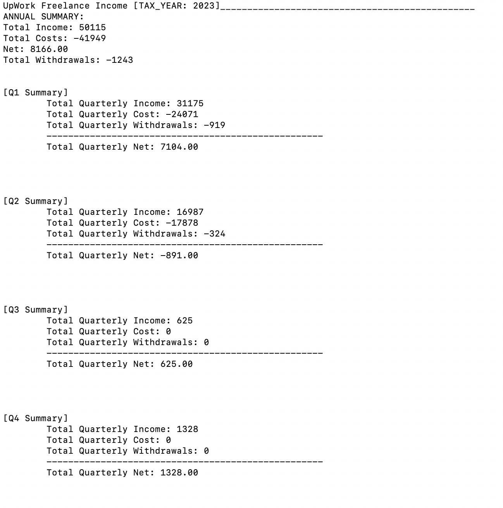

# UpworkIncomeSorter
Utility script for sorting Upwork jobs/income for quarterly/annual tax purposes from inputted 'transactions' CSV

## Internals
This script iterates through each 'Transaction' record and classifies each record as either an 'income', 'cost', or 'withdrawal' event determined by that record's 'type'.  Then the pandas package is used to sort each of these categories further into quarterly summarizations to show both gross and net amounts as well as withdrawal amounts.

## Setup

### Dependencies
The only dependency this project has is 'pandas'.  A dataframe is used for sorting transactions by date (read year or quarter).  To install, run ```pip install pandas```.

### Running / Workflow
Visit your Upwork account and navigate to the 'Transaction History' page from the 'Reports' dropdown.


Then on the page you are redirected to, use the date range to select a report for the dates you are interested in summarizing.


Then, click the 'Download CSV' button.  Copy the resulting, downloaded CSV report to this project's parent directory. Then inside of the *upwork_sorter.py* file, navigate down towards the bottom and set the *TRANSACTION_FILE_PATH* to point to this CSV file.

Also, set the *TAX_YEAR* variable to the year you'd like a summary report for.

Then run ```python upwork_sorter.py```.

You should then get an income summary printout for the configured tax year like this...



